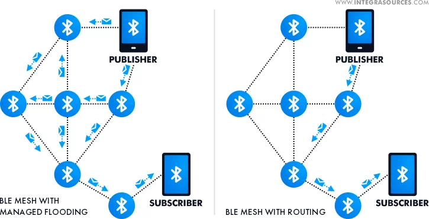

# B#NN — B Hash Neural Network

**Offline AI over Bluetooth mesh. No internet required.**

One device runs the AI model (via [Ollama](https://ollama.com)). Everyone else connects over Bluetooth Low Energy — phones, ESP32 boards, anything with BLE. Messages hop through a mesh of relay devices to extend range far beyond a single Bluetooth connection.

## 📹 B#NN Offline AI Network Demo

**[▶️ Click here to watch the video demonstration](https://drive.google.com/file/d/1huVFw_iwiZPHDZ5OntvzYXUwVjhuIRbP/view?usp=sharing)**

*Video shows the offline AI network in action*

---

## Architecture

```
┌──────────┐     BLE      ┌──────────┐     BLE      ┌────────────┐    HTTP     ┌──────────┐
│  Phone A │◄────────────►│  Phone B │◄────────────►│  Gateway   │◄──────────►│  Ollama  │
│  (client)│              │  (relay) │              │  (laptop)  │            │  AI model│
└──────────┘              └──────────┘              └────────────┘            └──────────┘
                                                          ▲
┌──────────┐     BLE                                      │
│  ESP32   │◄─────────────────────────────────────────────┘
│  (client)│
└──────────┘
```

- **Ollama** — runs the AI model locally (phi3, llama3, mistral, etc.)
- **Flask Server** (`server.py`) — REST API that bridges HTTP and Ollama
- **BLE Gateway** (`ble_gateway.py`) — BLE Central that connects to all peripherals
- **Android App** — BLE peripheral with chat UI, relay support
- **ESP32 Client** — BLE client for embedded/IoT devices

---

## Quick Start

### 1. Start the AI model
```bash
ollama pull phi3
ollama serve
```

### 2. Start the B#NN server
```bash
cd bnn-server
pip install -r requirements.txt
python server.py
```

### 3. Start the BLE gateway
```bash
# Linux / Raspberry Pi
sudo python ble_gateway.py

# The gateway will auto-discover B#NN devices
```

Then open the Android app or connect an ESP32 — they'll find the gateway automatically.

---

## Features

| Feature                    | Description                                                    |
|----------------------------|----------------------------------------------------------------|
| 🔌 **Fully Offline**      | No internet, no cloud — everything runs locally                |
| 📡 **BLE Mesh Networking**| Messages hop through relay devices to extend range             |
| 🔄 **Auto-Reconnect**     | Exponential backoff reconnection on disconnect                 |
| 📱 **Multi-Device**       | Connect phones, ESP32s, any BLE device simultaneously          |
| 💓 **Heartbeat**          | Ping/pong every 10s keeps connections alive                    |
| 📦 **Chunked Transfer**   | Large AI responses automatically split and reassembled         |
| 🛡️ **Dedup**             | Message ID tracking prevents relay loops in the mesh           |
| 🤖 **Multiple AI Models** | Switch between phi3, llama3, mistral, etc. via Ollama          |

---

## Directory Structure

```
B#NN/
├── README.md                  ← you are here
├── image.png                  ← project banner
├── bnn-server/
│   ├── README.md              ← server & gateway docs (setup, API, packet format)
│   ├── server.py              ← Flask API server (connects to Ollama)
│   ├── ble_gateway.py         ← BLE Central gateway (connects to all peripherals)
│   └── requirements.txt       ← Python dependencies
├── android/
│   ├── README.md              ← Android app docs
│   ├── BLEManager.kt         ← BLE peripheral logic (GATT server, notifications)
│   ├── MainActivity.kt       ← Chat UI and permissions
│   ├── ChatAdapter.kt        ← RecyclerView adapter for chat bubbles
│   └── …                     ← layouts, themes, build files
└── esp32_client/
    └── esp32_client.ino       ← ESP32 BLE client (GATT client, Serial interface)
```

---

## Detailed Documentation

- **[Server & Gateway Setup](bnn-server/README.md)** — API endpoints, BLE packet format, UUID reference, model recommendations, relay mode
- **[Android App](android/README.md)** — BLE peripheral, chat interface

---

## Contributing

1. Fork the repository
2. Create a feature branch (`git checkout -b feature/my-feature`)
3. Commit your changes (`git commit -am 'Add my feature'`)
4. Push to the branch (`git push origin feature/my-feature`)
5. Open a Pull Request

### Code style
- Python: follow existing formatting in `server.py` and `ble_gateway.py`
- Kotlin: follow existing formatting in `BLEManager.kt`
- Arduino: use section headers with `// ═══…` dividers (see `esp32_client.ino`)

---

## License

This project is licensed under the MIT License.

```
MIT License

Copyright (c) 2025 B#NN Contributors

Permission is hereby granted, free of charge, to any person obtaining a copy
of this software and associated documentation files (the "Software"), to deal
in the Software without restriction, including without limitation the rights
to use, copy, modify, merge, publish, distribute, sublicense, and/or sell
copies of the Software, and to permit persons to whom the Software is
furnished to do so, subject to the following conditions:

The above copyright notice and this permission notice shall be included in all
copies or substantial portions of the Software.

THE SOFTWARE IS PROVIDED "AS IS", WITHOUT WARRANTY OF ANY KIND, EXPRESS OR
IMPLIED, INCLUDING BUT NOT LIMITED TO THE WARRANTIES OF MERCHANTABILITY,
FITNESS FOR A PARTICULAR PURPOSE AND NONINFRINGEMENT. IN NO EVENT SHALL THE
AUTHORS OR COPYRIGHT HOLDERS BE LIABLE FOR ANY CLAIM, DAMAGES OR OTHER
LIABILITY, WHETHER IN AN ACTION OF CONTRACT, TORT OR OTHERWISE, ARISING FROM,
OUT OF OR IN CONNECTION WITH THE SOFTWARE OR THE USE OR OTHER DEALINGS IN THE
SOFTWARE.
```
